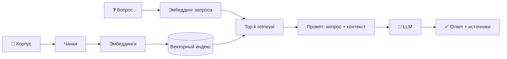
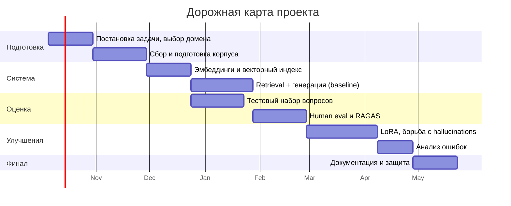

<!-- ================= HEADER ================= -->

 

<!-- ================= ABOUT ================= -->

## 🎯 О проекте

Система вопрос-ответ по корпусу документов на основе **RAG** (Retrieval-Augmented Generation) или дообученной LLM — с оценкой качества ответов и разбором случаев галлюцинаций.

> **Проблема.** Пользователям нужны точные ответы по большому корпусу документов. Обычный поиск по ключевым словам не даёт связного ответа, а LLM без контекста «галлюцинирует» — отвечает уверенно, но выдумывает факты.

| 🔤 Поиск по ключевым словам | 🤖 LLM без контекста | ✅ Наш подход |
|:---:|:---:|:---:|
| находит документы, но не отвечает на вопрос | отвечает связно, но может выдумывать | находит релевантные фрагменты и отвечает **строго по ним** |

| | |
|---|---|
| 🧩 **Тип задачи** | Question answering, генерация текста |
| 🗂 **Данные** | Собственный корпус документов или открытые корпуса (например, статьи arXiv) |
| 🛠 **Методы** | Эмбеддинги + vector store (FAISS / Qdrant / Chroma) + retrieval + генерация LLM; альтернатива — LoRA fine-tuning небольшой open-source модели |
| 📏 **Метрики** | Human eval, RAGAS (faithfulness, relevance), latency |
| 🧪 **Усложнения** | Сравнение чистого RAG vs fine-tuning; борьба с hallucinations; тест на adversarial-вопросах |
| 🎓 **Уровень** | PRO |

<!-- ================= TEAM ================= -->

## 👥 Команда

### 🧭 Руководители проекта

| | | | |
|:---:|:---:|:---:|:---:|
| Мовсумов Денис | Абакумов Юрий | Цуриков Виталий | Панчук Георгий |
| Мустафин Фарид | Голубев Александр | Родионов Никита | |

### 🧑‍🏫 Куратор

> **_ФИО куратора_** <!-- TODO: указать куратора -->

### 🧑‍💻 Участники

| ФИО | Роль | Связь |
|-----|------|-------|
| _ФИО_ | _например, Team Lead / Data_ |  |
| _ФИО_ | _например, Retrieval / Vector store_ |  |
| _ФИО_ | _например, LLM / Generation_ |  |
| _ФИО_ | _например, Evaluation / Testing_ |  |

<!-- TODO: заполнить состав команды -->

<!-- ================= APPROACH ================= -->

## 🧠 Подход

**RAG vs fine-tuning** — в рамках усложнений сравниваем оба подхода:

| | 🔎 RAG | 🎛 LoRA fine-tuning |
|---|---|---|
| **Знания** | берутся из корпуса в момент запроса | «зашиваются» в веса модели |
| **Обновление корпуса** | переиндексация | повторное обучение |
| **Источники** | можно ссылаться на фрагменты | напрямую не указываются |
| **Риск галлюцинаций** | ниже, если контекст найден верно | выше без опоры на документы |

<!-- ================= STACK ================= -->

## ⚙️ Планируемый стек

  

 

<!-- ================= PLAN ================= -->

## 🗺 План работы

> Черновой план на учебный год — будет уточняться вместе с куратором. Сроки ориентировочные.

| | Этап | Результат |
|:-:|------|-----------|
| 1️⃣ | Постановка задачи: домен, корпус, метрики и пороги | Описание проекта, репозиторий |
| 2️⃣ | Сбор, очистка и разбиение корпуса на чанки | Подготовленный корпус |
| 3️⃣ | Эмбеддинги и векторный индекс | Проиндексированный корпус |
| 4️⃣ | Retrieval + генерация ответа LLM | Baseline RAG |
| 5️⃣ | Тестовый набор вопросов с эталонами (в т.ч. adversarial) | Размеченный набор |
| 6️⃣ | Оценка: human eval, RAGAS, latency | Отчёт с метриками |
| 7️⃣ | Улучшения: retrieval, hallucinations, LoRA, RAG vs fine-tuning | Сравнительный анализ |
| 8️⃣ | Анализ неудачных ответов и меры по их снижению | Разбор failure cases |
| 9️⃣ | Итоговая документация, демо, защита | Готовый проект |

<b>☑️ Чек-лист</b>

 

- [x] Создан репозиторий проекта
- [ ] Определены домен и корпус документов
- [ ] Корпус собран и проиндексирован
- [ ] Реализован baseline RAG
- [ ] Собран тестовый набор вопросов с эталонами
- [ ] Проведена оценка (human eval / RAGAS)
- [ ] Выполнено сравнение RAG vs fine-tuning
- [ ] Задокументированы неудачные ответы и меры по их снижению
- [ ] Подготовлена защита проекта

<!-- ================= METRICS ================= -->

## 📊 Метрики и критерии приёмки

| 🎯 Faithfulness | 💬 Relevance | 🧑‍⚖️ Human eval | ⏱ Latency |
|:---:|:---:|:---:|:---:|
| ответ опирается на источники, без выдумок | ответ действительно отвечает на вопрос | экспертная оценка ответов | время отклика системы |

**Критерии приёмки**

1. Корпус документов собран и проиндексирован.
2. На тестовом наборе вопросов ответы оценены по релевантности и достоверности (human eval или RAGAS) **выше согласованного порога**.
3. Задокументированы случаи неудачных ответов и предложены меры их снижения.

<!-- ================= FOOTER ================= -->

**RAG-система / дообучение LLM под домен · Годовой проект · Уровень PRO**

