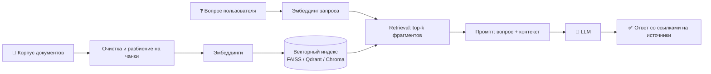

 

**Вопросно-ответная система по корпусу документов: точные ответы, ссылки на источники и борьба с галлюцинациями**

[О проекте](#-о-проекте) •
[Команда](#-команда) •
[Подход](#-подход) •
[План работы](#-план-работы) •
[Метрики](#-метрики-и-критерии-приёмки)

## 📌 О проекте

Годовой проект по теме **«RAG-система / дообучение LLM под домен»**.

### Проблема

Пользователям нужны точные ответы по большому корпусу документов, но:

- 🔤 **обычный поиск по ключевым словам** не даёт связного ответа — приходится самому читать десятки документов;
- 🤖 **LLM без контекста** «галлюцинирует»: отвечает уверенно, но выдумывает факты и не знает содержимого нашего корпуса.

### Цель

Построить систему вопрос-ответ по корпусу документов на основе **RAG** (Retrieval-Augmented Generation) или дообученной LLM, а также измерить качество её ответов и проанализировать случаи галлюцинаций.

| | |
|---|---|
| **Тип задачи** | Question answering, генерация текста |
| **Данные** | Собственный корпус документов или открытые корпуса (например, статьи arXiv) |
| **Методы** | Эмбеддинги + vector store + retrieval + генерация LLM; альтернатива — LoRA fine-tuning небольшой open-source модели |
| **Метрики** | Качество ответов (human eval, RAGAS: faithfulness, relevance), latency |
| **Усложнения** | Сравнение чистого RAG и fine-tuning; борьба с hallucinations; тест на adversarial-вопросах |
| **Уровень** | PRO |

## 👥 Команда

### Руководители проекта

Мовсумов Денис · Абакумов Юрий · Цуриков Виталий · Панчук Георгий · Мустафин Фарид · Голубев Александр · Родионов Никита

### Куратор

> 🧑‍🏫 **Куратор:** _ФИО куратора_ <!-- TODO: указать куратора -->

### Участники

| # | ФИО | Роль в проекте | GitHub |
|:-:|-----|----------------|--------|
| 1 | _ФИО_ | _например, Team Lead / Data_ | [@username](https://github.com/) |
| 2 | _ФИО_ | _например, Retrieval / Vector store_ | [@username](https://github.com/) |
| 3 | _ФИО_ | _например, LLM / Generation_ | [@username](https://github.com/) |
| 4 | _ФИО_ | _например, Evaluation / Testing_ | [@username](https://github.com/) |

<!-- TODO: заполнить состав команды -->

## 🧠 Подход

Основной вариант — **RAG-пайплайн**: вместо того чтобы полагаться на память модели, мы находим релевантные фрагменты в корпусе и просим LLM ответить строго по ним.

**Альтернатива** — LoRA fine-tuning небольшой open-source модели на доменных данных.
В рамках усложнений мы сравним оба подхода: **чистый RAG vs fine-tuning** (и, возможно, их комбинацию).

## 🗺 План работы

> Черновой план на учебный год — будет уточняться вместе с куратором.

| Этап | Что делаем | Результат |
|:----:|------------|-----------|
| **1** | **Постановка задачи.** Выбор домена и корпуса, согласование метрик и порогов качества | Описание проекта, репозиторий, план |
| **2** | **Корпус документов.** Сбор, очистка, разбиение на чанки | Подготовленный корпус |
| **3** | **Индексация.** Выбор модели эмбеддингов, построение векторного индекса | Проиндексированный корпус |
| **4** | **Retrieval + генерация.** Реализация поиска и генерации ответа LLM | Работающий baseline RAG |
| **5** | **Тестовый набор.** Формирование вопросов с эталонными ответами (в том числе adversarial) | Размеченный тестовый набор |
| **6** | **Оценка качества.** Human eval, RAGAS (faithfulness, relevance), замеры latency | Отчёт с метриками |
| **7** | **Улучшения и эксперименты.** Настройка retrieval, борьба с hallucinations, LoRA fine-tuning, сравнение RAG vs fine-tuning | Сравнительный анализ |
| **8** | **Анализ ошибок.** Документирование неудачных ответов и мер по их снижению | Разбор failure cases |
| **9** | **Финал.** Итоговая документация, демо, подготовка защиты | Готовый проект и презентация |

### Чек-лист

- [x] Создан репозиторий проекта
- [ ] Определены домен и корпус документов
- [ ] Корпус собран и проиндексирован
- [ ] Реализован baseline RAG
- [ ] Собран тестовый набор вопросов с эталонами
- [ ] Проведена оценка (human eval / RAGAS)
- [ ] Выполнено сравнение RAG vs fine-tuning
- [ ] Задокументированы неудачные ответы и меры по их снижению
- [ ] Подготовлена защита проекта

## 📊 Метрики и критерии приёмки

**Метрики**

- **Faithfulness** — ответ опирается на найденные источники и не содержит выдумок;
- **Relevance** — ответ действительно отвечает на заданный вопрос;
- **Human evaluation** — экспертная оценка ответов;
- **Latency** — время отклика системы.

**Критерии приёмки**

1. Корпус документов собран и проиндексирован.
2. На тестовом наборе вопросов ответы оценены по релевантности и достоверности (human eval или RAGAS) **выше согласованного порога**.
3. Задокументированы случаи неудачных ответов и предложены меры их снижения.

